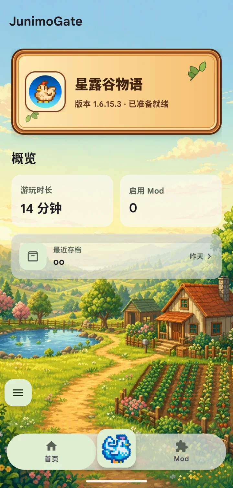
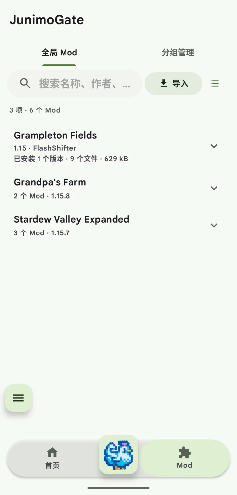

[English](README.md) | **简体中文**

# JunimoGate

JunimoGate 是一个面向《星露谷物语》的 Android SMAPI 启动器，集成 Android
SMAPI 运行环境，并提供启动、Mod、存档和诊断管理。

<p align="center">
  
  
</p>

## 功能

JunimoGate 当前提供：

- 通过集成的 Android SMAPI 启动《星露谷物语》；
- 导入 Mod 压缩包，并在统一的 Mod 库中管理已安装版本；
- 搜索 Mod、按分组整理、选择启用内容并分享；
- 发现、导入和导出存档，以及管理存档备份；
- 查看启动器和 SMAPI 日志以排查问题；
- 首次准备完成后获得更快的日常启动；
- 英文和简体中文界面。

## 致谢

JunimoGate 在项目目标上延续了
[NRTnarathip/SMAPILoader](https://github.com/NRTnarathip/SMAPILoader)
对 Android SMAPI 启动器的工作，JunimoGate 启动器代码为独立实现。感谢该项目
以及此前相关社区工作的探索。

项目内置的 JunimoGate-SMAPI 基于
[Pathoschild/SMAPI](https://github.com/Pathoschild/SMAPI) 和
[NRTnarathip/SMAPI-Android-1.6](https://github.com/NRTnarathip/SMAPI-Android-1.6)，
并由 JunimoGate 项目继续进行 Android 集成和维护。确切源码提交记录在
[Android 分支来源文档](smapi/docs/android/provenance.md)中。

## 构建指南

克隆仓库及其 SMAPI 子模块：

```bash
git clone --recurse-submodules https://github.com/leontismaro/JunimoGate.git
cd JunimoGate
```

完整的[构建环境与脚本指南](docs/build-environment.md)说明了前置条件、仓库本地
Android 工具链、`build/` 下所有公开入口、游戏本地编译引用、验证方式和生成物。

典型开发构建命令如下：

```bash
./build/bootstrap-android.sh
./build/build-monogame-android.sh

export JUNIMOGATE_GAME_REFERENCE_DIR="/absolute/path/to/game/assemblies"
./build/build-android.sh Debug app
```

该目录只是本地编译引用。构建脚本不会搜索游戏文件，也不会将商业游戏内容复制到
仓库或 APK 中。

## 项目结构

- `src/JunimoGate.App`：Android 启动器应用与界面；
- `src/JunimoGate.Android`：Android 包与私有存储边界；
- `src/JunimoGate.Extraction`：发现和准备游戏输入；
- `src/JunimoGate.Rewriter`：应用带结构守卫的 Android bridge 改写；
- `src/JunimoGate.GameHost`：独立进程与 SMAPI host contract；
- `src/JunimoGate.Mods`：Mod 库、分组、选择与传输数据；
- `smapi/`：作为 Git 子模块跟踪的 Android SMAPI 分支；
- `build/`：工具链、构建、打包与验证入口；
- `tests/` 和 `tools/`：自动化检查与开发工具；
- `docs/`：架构、维护、验证与发布记录。

维护中的设计以[文档索引](docs/README.md)、[启动链](docs/startup-chain.md)和
[SMAPI 架构](docs/smapi-architecture.md)为入口。

## 许可证

除已注明的第三方材料以及具有独立许可证的仓库外，JunimoGate 自有材料采用
[GPL-3.0-only](LICENSE)，并包含
[LICENSE-EXCEPTION](LICENSE-EXCEPTION) 中针对链接的窄范围额外许可。

`smapi/` 子模块继续采用 LGPL-3.0-only。MonoGame、OpenAL Soft、.NET runtime
及其他依赖分别保留其自身许可证。详见[第三方声明](THIRD-PARTY-NOTICES.md)和
[开源发布检查清单](docs/open-source-release.md)。

JunimoGate 是独立的非官方项目。《星露谷物语》及相关名称和标志归各自权利人
所有。本项目未获 ConcernedApe、《星露谷物语》或 SMAPI 项目认可，也不隶属于
这些主体。

产品截图中可见的第三方名称、标志和游戏相关元素仍归各自权利人所有。
